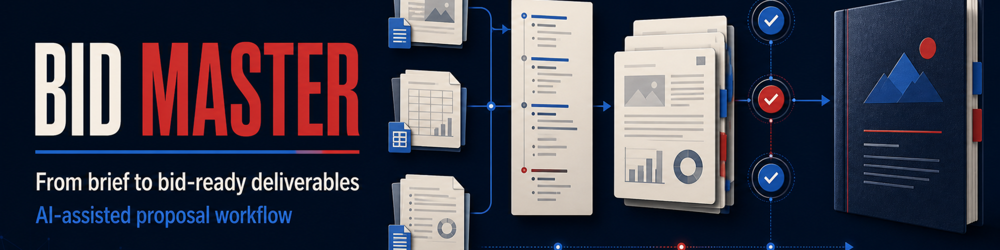
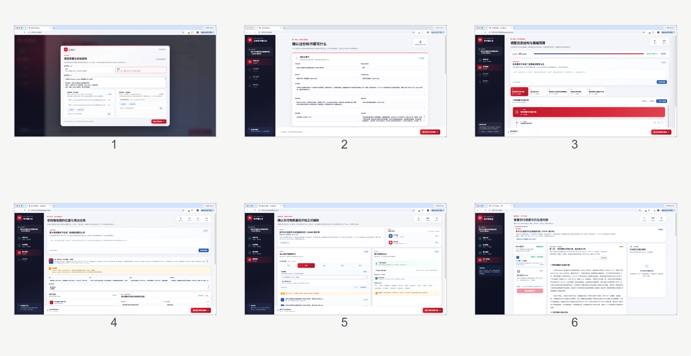

# Biaoshu Master



> 把需求、规则和项目资料，变成有依据、有结构、可审阅、可交付的正式标书。
>
> A local-first, AI-assisted proposal workflow for turning briefs and source materials into bid-ready deliverables.

Biaoshu Master 不是一段“把文字写长”的提示词，也不是把几份材料丢给模型后直接等待一份长文档的黑盒。它是一套面向正式投标与方案竞标的本地优先、分阶段 AI 协作工作流：先建立项目事实与写作边界，再组织评分响应、章节框架和篇幅预算，最后分批生产 Word、执行 AI 复校、开放人工审阅并完成交付锁定。

它不局限于政企标书。政府与公共服务、通信与信息化、软件与 SaaS、系统集成、云服务、工程建设、制造与能源、医疗与教育、咨询与运营、采购与培训，以及其他需要正式方案和投标文件的行业项目，都可以使用同一套底层流程。行业表达由项目资料、用户口径和所选生成规则共同决定。

## 一句话理解

如果普通写作工具解决的是“生成一段文字”，Biaoshu Master 解决的是：

```text
招标文件 / 需求书 / 评分表 / 项目资料
                    ↓
        事实底座 + 评分响应 + 目录与篇幅预算
                    ↓
      图片规划 + Word 分批生产 + AI 复校与回修
                    ↓
              人工审阅 + 版本化最终交付
```

它把一次容易失控的长对话，拆成可以暂停、确认、回看、修改、复校和恢复的多个交接点。每个交接点都有结构化回执和项目级状态，便于定位“依据是什么、改了什么、当前是否可以交付”。

## 它解决什么问题

正式标书的难点通常不只是文字量，而是多个约束同时存在：

- 需求、评分、客户口径和内部经验往往分散在不同文件中；
- 历史案例有方法价值，但其中的客户、人员、业绩和数字不能直接带入新项目；
- 目录、评分响应、章节深度和最终页数需要互相匹配；
- 长篇生成容易出现重复段落、章节之间断裂、术语漂移和承诺越界；
- Word 导出之后还可能产生结构、页数、表格和分批切割问题；
- 人工审阅很难逐段发现所有机械重复和隐性事实错误。

Biaoshu Master 将这些问题放入同一条生产链，并把“AI 重新核对”和“人工确认”明确分开：AI 复校不通过时，不能把正文直接交给用户确认；用户只在当前批次达到可审阅状态后做最终判断。

## 核心能力

| 能力 | 解决的问题 | 主要产出 |
| --- | --- | --- |
| 资料分层与权威管理 | 正式文件和历史案例混用，导致事实越界 | 背景资料、参考资料、读取优先级和采用边界 |
| 项目事实底座 | 项目名称、主体、范围、期限、人员和承诺口径漂移 | 项目卡、确定事实、待确认项和不可写事项 |
| 评分响应组织 | 只复制评分表，正文却没有自然、逐点的应答 | 评分响应矩阵、需求依据、应答章节和证据状态 |
| 目录与篇幅预算 | 目录过粗、标题机械拆分或正文页数失控 | 一至三级确认骨架、章节页数、内容颗粒度 |
| 图片规划 | 先做图再想表达，图片与正文脱节 | 章节图片清单、核心节点、构图方向和 AI 提示词 |
| 分批 Word 生产 | 长文一次输出难以检查，章节边界容易被破坏 | 1 至 5 个按授权生成的 Word 批次 |
| AI 复校与回修 | 重复段落、规则遗漏、跨批不一致无法及时发现 | 复校报告、阻断问题、修订版和重新导出结果 |
| 本地确认与审校 | 页面刷新或中断后无法知道当前状态 | 版本化 JSON 回执、摘要、哈希绑定和恢复信息 |
| 生成规则管理 | 不同行业都套用同一套表达要求 | 默认规则、领域预设和用户确认后的自定义规则 |

## 主要交付物

一次完整流程通常包含以下交付物，具体数量以项目确认页中的授权为准：

- 1 至 5 个按章节拆分的 Word 标书文件；
- 1 个图片规划 Excel，包含图号、章节位置、用途、核心节点、构图方向和逐图 AI 生图提示词；
- 项目级确认回执、阶段摘要、导出校验结果和 AI 复校记录；
- 需要返工时产生的修订版 Word、问题处理记录和新的审校回执；
- 可选的行业生成规则：默认规则、领域预设或用户确认后登记的自定义规则。

项目资料、生成的 Word/Excel、确认回执和本机运行状态保存在项目工作区中，不会自动进入本 Skill 的公共源代码目录。

## 工作方式

### 1. 先区分“事实”与“参考”

入口将资料分为两类：

- **背景资料**：招标文件、需求书、评分表、澄清文件、客户正式资料和用户明确确认的项目口径。它们决定项目事实、需求、数字、时限、评分响应和承诺边界。
- **参考资料**：历史项目、成熟方案、公司经验和类似标书。它们只提供可选的方法、结构和表达参考，不能直接成为当前项目事实。

参考资料中的客户名称、人员、证书、业绩、日期、指标和承诺，必须先与当前项目背景及用户口径核对；不能因为文字写得成熟，就默认可以使用。

### 2. 先确认结构，再写正文

项目不会从一段模糊需求直接跳到长篇正文。正式生产前，依次确认项目口径、评分响应、目录结构、章节篇幅、图片规划和最终授权。阶段2确认的一至三级标题是正文骨架，Stage4 只能在其下展开真实的四级及以下内容，不能静默改名、删章、增章或改变编号。

### 3. 把 AI 复校放在人工审阅之前

每个 Word 批次导出后，都会先进入 AI 复校状态。当前 AI 必须重新读取本项目的 Stage4 写作规则、结构化源稿、导出的 Word 和本地导出校验结果，至少检查：

- 规则硬约束和正式写作边界；
- 项目事实、人员、数字、证书、业绩和承诺是否越界；
- 一至三级确认骨架是否完整、顺序是否一致；
- 评分响应是否落到正确章节，是否出现空泛应答；
- 完全重复、近似重复、机械改写和章节间重复承诺；
- 分批切割产生的断裂、重复开头、过渡残留和术语不一致；
- Word 结构、表格、列表、占位和预计页数。

复校存在阻断问题时，批次会回到修订和重新导出，不开放人工确认。只有 AI 复校通过且源稿、Word、授权和规则快照一致时，用户才会看到“可审阅”状态。

### 4. 用回执管理变化

确认台和生产审校台不是依赖页面临时状态的演示页面。阶段推荐、用户确认、修改请求、导出校验和 AI 复校都会写入项目目录，并绑定上游摘要或哈希。页面刷新、关闭或宿主中断后，可以从项目状态恢复；只读回看不会改变后台生产状态，只有用户明确点击“修改本阶段”并完成二次确认，才会归档受影响的下游结果。

## 四个可见阶段

### 01 项目口径

读取并分析背景资料，建立项目卡和事实边界。这里会确认项目名称、招标人或客户、服务对象、范围、期限、目标、成果要求、人员要求、主体口径、已知冲突和不可写内容。

### 02 标书框架

建立评分响应矩阵，规划一至三级目录、章节顺序和篇幅预算。目录不追求每章标题数量整齐，而是根据内容颗粒度安排场景、角色、输入、步骤、工具、成果、边界、异常和验证。用户可以编辑标题、增删节点、调整同级顺序和重新分配章节页数。

### 03 图片规划

统一规划视觉方向和章节图片。每张图片记录位置、图名、用途或核心表达、核心节点、构图、方向和逐图提示词。此阶段确认的是“需要什么图、图要表达什么”，不是直接生成图片，也不会把图片插入 Word。

### 04 生产与审校

用户授权后按选择的生成规则和 Word 批次数量生产正文。每批经历“源稿整理 → Word 导出 → 本地结构校验 → AI 复校 → 人工审阅 → 确认或回修”。全部 Word 批次和图片规划 Excel 均确认后，才开放最终交付确认。

内部执行状态还会经过 G0 至 G7 的细分闸门：资料接收、项目口径、评分矩阵、目录页数、正文批次、图片、整合校正和终审。可见页面保持简洁，细分状态用于控制交接、恢复和质量检查。

## 标书定位

入口支持两种常见定位：

- **主标**：以完整、准确、扎实和可执行为目标，对需求和评分点形成自然、充分的点对点响应。
- **陪标**：保持基本合格和完整的方案形态，允许用户调整目标页数，并按确认口径选择不重要的评分点不写；不能把主标事实或参考项目证据直接复制过来。

定位只影响当前项目的生产策略，不会改变默认规则，也不会改变其他项目。

## 规则与行业适配

Stage4 默认使用通用标书生成规则，也可以选择规则索引中的领域预设或用户自定义规则。规则选择会与本次最终授权、项目级快照和后续 AI 复校绑定，保证“按什么规则生成”和“按什么规则检查”一致。

当用户需要新的行业规则时，可以在对话中显式发送：

```text
请用biaoshu-master技能，帮我制作专属的标书生成规则
```

规则制作模式会先逐步收集适用领域、重点写作要求、事实边界、结构要求、重复控制、格式约束和禁忌表达，再输出可审阅的规则草案。只有用户明确确认后，规则才会登记到本机 Skill；默认规则不会被覆盖，已有项目也不会被悄悄改写。

## 写作与交付边界

### 必须坚持

- 正文使用“招标人”“我司”等正式、稳定的主体称谓；
- 以正式招标文件、需求书、澄清文件和用户确认口径为事实优先来源；
- 需求响应要落到任务、方法、成果、责任、时限和验证，而不是只重复原文；
- 通过真实的场景、角色、步骤、输入、输出、异常和检查机制增加内容深度；
- 章节之间保持术语、角色、交付物和承诺的一致；
- 发现资料冲突、事实缺失或证据不足时标记待确认，不能自行补齐；
- 让正文服务于评审和交付，避免“根据会议”“为满足评分”“后续展开”等制作痕迹。

### 明确不做

- 不编造人员、证书、业绩、系统、数字、客户授权、合同承诺或项目结果；
- 不把历史案例中的客户、日期、数据和承诺直接套入当前项目；
- 不用同义改写、重复段落、重复表格或无意义标题来凑篇幅；
- 不把评分表机械复制成正文，也不为追求目录整齐强行拆分内容；
- 不因页面刷新、只读回看或查看前序阶段就自动回退流程；
- G0 至 G7 默认只生成 Word 和图片规划 Excel，不生成或插入图片，不记录成图路径；
- 不把项目资料、确认回执、交付物、本机运行数据、绝对路径或凭据写入公共 Skill 源码。

### 关于页数

页数预算用于在写作前组织篇幅，并帮助发现章节过薄或分配失衡。AI 预计页数达到计划页数允许范围时，可以作为审校依据；最终页数仍以目标办公软件实际打开结果为准。若用户登记的实际页数超出范围，系统会触发扩写或压缩的审校版迭代，不能用新增空标题或重复文字机械补页。

### 关于图片

确认与正文交付阶段只交付图片规划，不调用生图接口，不制作或插入图片。规划表中的逐图提示词可以交给其他 AI 生图。全部交付完成后，如果用户明确回复“继续”，才可以进入独立的本机生图流程；用户没有明确授权时保持最终交付状态不变。

## 快速开始

### 前置条件

需要一个具备以下能力的 AI 宿主：

- 能读取和写入本机文件；
- 能执行 Python 脚本或等效的本地命令；
- 能保持持续对话，并在确认台等待用户操作；
- 能访问用户明确提供的本地资料路径。

本 Skill 不绑定某一家模型或客户端。Codex、WorkBuddy 以及其他具备本地文件和命令能力的宿主，都可以按同一套项目文件协议执行。

### 安装运行依赖

在 Skill 目录中执行：

```bash
python3 scripts/install_dependencies.py
```

核心依赖用于读取评分表、生成图片规划 Excel、导出 Word 和执行本地结构校验。详细说明见 [INSTALL.md](INSTALL.md)。

### 创建或恢复项目工作区

首次进入一个项目时，先解析稳定的项目工作区：

```bash
python3 scripts/project_workspace.py resolve \
  --project-name "项目名称" \
  --client "招标人或客户" \
  --tender-reference "招标编号"
```

工作区默认位于 `~/Documents/biaoshu-master-projects`。解析器会根据项目名称、客户、招标编号以及可选的背景资料路径识别项目：同一项目复用原目录，不同项目创建不同目录；项目资料只记录用户提供的本地路径，不会由工作区管理器复制。

### 在对话中调用

只有当前消息明确引用本 Skill 时才会启动，例如：

```text
请使用 $biaoshu-master，读取以下招标文件和评分表，帮我制作一份主标。
背景资料：/absolute/path/to/tender.docx
背景资料：/absolute/path/to/scoring.xlsx
参考资料：/absolute/path/to/previous-project.docx
```

调用后，AI 会先打开本地确认入口，区分背景资料和参考资料，再按四个阶段推进。每个大阶段结束都会停在确认闸门；只有用户明确确认或继续，才进入下一个阶段。用户可以在阶段页面直接修改字段，提交后的前端回执优先于 Skill 默认值。

如果只是在聊天中讨论“标书”但没有明确调用 `biaoshu-master`，本 Skill 不会自动接管任务。

## 项目工作区生命周期

Skill 安装目录只保存通用规则、脚本、协议和脱敏示例；项目工作区保存当前项目的确认状态、运行日志、结构化源稿、导出物和审校回执；最终交付目录可以由用户单独指定。这三者互相分离。

同一个项目再次使用时，解析器会复用稳定工作区，并保留项目身份；恢复中断时保留当前入口和运行编号。用户要求重新开始一轮时，旧确认状态和旧交付区会归档，新的流程继续使用同一个项目身份，避免新旧项目混用。

阶段1至3确认后的内容可以只读回看。只有用户点击“修改本阶段”并完成二次确认，才会让该阶段及受影响的下游结果失效；如果 Stage4 已经在生产或 AI 复校，回退动作会先停止对应的本地生产服务，再恢复到用户选择的阶段。

## 界面示例

下面的展示图按实际页面顺序整理，覆盖资料入口、项目口径、标书框架、图片规划、最终确认和生产审校。截图仅展示通用界面，不含项目交付资料。



## 目录与文档导航

```text
biaoshu-master/
├── SKILL.md                         # 宿主执行规则与阶段协议
├── README.md                        # 项目介绍与快速开始
├── INSTALL.md                       # 依赖安装说明
├── skill-version.json               # 本地版本信息
├── agents/                          # 宿主元数据
├── assets/                          # 品牌图和脱敏界面示例
├── references/                      # 确认、生产、审校和规则协议
├── rules/                            # 默认、预设和自定义规则索引
└── scripts/                          # 工作区、确认台和导出工具
```

建议按以下顺序阅读：

- [SKILL.md](SKILL.md)：完整的调用条件、确认闸门、资料边界和执行规则；
- [INSTALL.md](INSTALL.md)：运行依赖和环境准备；
- [确认台协议](references/confirmation-ui.md)：项目工作区、阶段回执、导航和恢复；
- [生产与审校台协议](references/production-review.md)：Word/Excel 生产、AI 复校、回修和最终交付；
- [Stage4 写作规则](references/stage4-writing-rules.md)：正文结构、深度、重复控制和正式写作要求；
- [专属规则制作模式](references/custom-rule-authoring.md)：行业规则的设计、确认和登记；
- [终审检查表](references/review-checklists.md)：交付前的人工与 AI 检查项；
- [最终交付后的生图协议](references/post-delivery-image-generation.md)：用户明确授权后的可选生图流程。

项目地址：[github.com/weiweidounai0131/biaoshu-master](https://github.com/weiweidounai0131/biaoshu-master)

## 隐私与公开边界

公共仓库只包含通用 Skill 代码、规则、文档和不含项目隐私的界面示例。招标文件、需求书、评分表、参考项目、项目背景、确认回执、结构化源稿、Word/Excel 交付物、本机运行数据、绝对路径和凭据都应留在本地项目目录，不会被本 Skill 自动上传或复制到公共仓库。

如果需要把新的行业经验沉淀成规则，应先去除项目专属事实和敏感信息，再通过规则制作模式确认后登记；不要把整份项目标书或客户资料直接放入通用 Skill。
