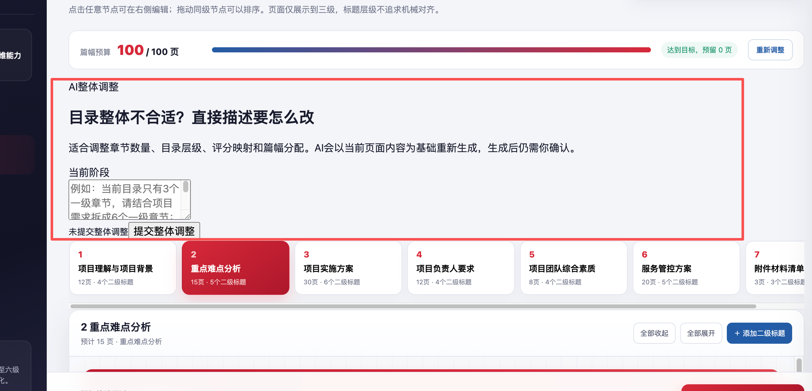
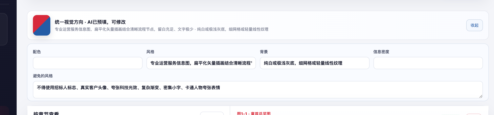

# biaoshu-master

面向政企类项目的标书分阶段协作与交付工作流。适用于政府部门、事业单位、国企、央企及其他企业客户的技术服务、咨询运营、信息化建设、系统集成、运维保障、培训实施和采购服务项目。

本 Skill 将资料分析、项目口径确认、评分响应、目录与篇幅规划、图片规划、正文生产、Word 审校和最终交付拆成可核验的阶段。每个阶段都有明确的确认闸门，适合需要留痕、复核和多轮修订的正式投标场景。

## 核心能力

- 区分背景资料与参考资料：背景资料约束项目事实、需求、评分、数字、时限和承诺；参考资料只提供经核对后的策略与表达参考，不能直接变成项目事实。
- 通过本地确认台确认项目口径、主标或陪标定位、评分响应、目录层级、页数预算和图片规划。
- 支持阶段2和阶段3的 AI 整体调整；确认后的新目录、篇幅和视觉方向会覆盖旧推荐，并保留回执绑定关系。
- 按用户确认的 1 至 5 个批次生成和审校 Word 标书，执行结构、篇幅、格式、事实边界和渲染检查。
- 固定交付 1 个图片规划 Excel，为每张图片提供与已确认规划一致的“AI生图提示词”。
- 最终交付汇总后，只有用户明确回复“继续”才进入首张示例图确认和剩余图片分批生成流程。
- 使用本地 JSON、哈希和事件协议记录确认、回修、导出和交付状态，便于恢复中断流程。
- 每批 Word 导出后必须经过当前 AI 的规则、事实、重复、跨批一致性和导出结果复校；复校通过后才开放人工审阅和确认。
- Stage4提供默认规则、3个领域预设和自定义规则选择；自定义规则通过规则制作对话确认后写入本机Skill，并可设为后续默认。
- 使用独立的持久化项目工作区索引区分不同项目；同一项目可恢复原工作区，新一轮会归档旧状态后复用外层目录。

## 工作流

`G0 资料接收 → G1 项目口径 → G2 评分响应 → G3 目录与篇幅 → G4 正文批次 → G5 图片规划 → G6 整合校正 → G7 终审`

每个大流程结束后都会停止等待用户确认。阶段4正文生成前必须读取并执行 `references/stage4-writing-rules.md` 中的事实、论证、篇幅、格式和交付门禁。

## 资料边界

| 资料类别 | 作用 | 使用限制 |
| --- | --- | --- |
| 背景资料 | 项目需求、招标文件、评分表、澄清文件和正式资料 | 是项目事实底座，约束数字、时限、评分响应和承诺边界 |
| 参考资料 | 历史项目、成熟策略、公司经验和类似标书 | 只提供可选方法与表达；采用前必须核对适用性，不得带入旧客户、人员、业绩、证书、数字或承诺 |

## 项目工作区

项目工作区与 Skill 安装目录、最终交付物保存目录分离。首次进入项目流程前，运行：

```bash
python3 scripts/project_workspace.py resolve \
  --project-name "项目名称" \
  --client "招标人或客户"
```

可按需要追加 `--tender-reference "招标编号"` 和一个或多个 `--background-path "/绝对路径/需求书.docx"`。脚本返回稳定的 `project_id` 和 `project_dir`。同一项目再次解析时复用原目录；不同项目创建新目录。需要明确开启同名新项目时使用 `--new`，需要接管旧版本目录时使用 `--project-dir`。工作区根目录默认是 `~/Documents/biaoshu-master-projects`，可用 `BIAOSHU_PROJECTS_ROOT` 或 `--root` 改变。

在同一工作区内，`prepare_intake.py --resume` 表示继续原运行；不带 `--resume` 表示重新开始一轮，旧确认状态和旧交付区会归档保留，避免新旧项目状态混用。

Stage4的交付物保存位置由本机确认台选择：macOS使用系统文件夹选择器，Windows优先使用PowerShell原生文件夹对话框，选择器不可用时仍可粘贴绝对路径。生产与审校台运行期间可以只读回看前3个阶段；从前序阶段确认“修改本阶段”后，当前生产服务会先停止，旧交付轮次再归档。

规则配置由 `scripts/rule_profiles.py` 管理：`list` 查看规则，`set-default <id>` 设置后续默认规则，`register` 登记用户确认的 Markdown 覆盖层。Stage4页面中的“新建专属规则”会给出标准对话引导语；规则制作模式不会启动标书生产。

## 界面示例

阶段2支持直接描述目录、评分映射和篇幅预算的整体调整：



阶段3会预填统一视觉方向，并为图片规划生成逐图提示词：



截图仅用于展示通用界面能力，不包含项目交付资料或客户信息。

## 安装与使用

将 Skill 包解压到宿主支持的技能目录，确保目录根部包含 `SKILL.md`、`agents/`、`references/` 和 `scripts/`。首次使用前运行：

```bash
python3 scripts/install_dependencies.py
```

只有在用户当前消息明确引用 `$biaoshu-master`、`biaoshu-master` 或技能路径时，本 Skill 才会启用；仅讨论标书不会触发它。

## 更新检测

本 Skill 使用 `skill-version.json` 保存本地版本，按 GitHub Contents API、GitHub `refs/heads` 原始文件、GitCode Contents API 的顺序检查远端版本；GitHub 不通时自动切换 GitCode。更新检测不依赖本地 `.git`，因此 Git 安装和 ZIP 安装都能使用同一套逻辑，也不会因普通 `raw/.../main` 地址的短时缓存误判版本：

```bash
python3 scripts/check_skill_update.py
```

检测到远端版本更高时，先向用户询问是否更新；只有用户明确同意后才执行：

```bash
python3 scripts/check_skill_update.py --update
```

更新成功后重新显式调用本 Skill，避免新旧协议和项目回执混用。更新脚本只访问公开版本清单和技能包，不上传项目资料。

本 Skill 的 canonical 源码同时推送到 [GitHub](https://github.com/weiweidounai0131/biaoshu-master) 和 [GitCode](https://gitcode.com/gcw_mHRylKw0/biaoshu-master)。用户要求发布更新时，两个平台必须使用同一个提交并分别核对远端分支；项目资料和本机运行数据不进入任一公开仓库。

## 隐私与公开边界

公开仓库只包含通用 Skill 代码、规则、文档、配置和脱敏界面截图。项目背景、招标文件、参考资料、确认回执、Word/Excel 交付物、本机运行数据、绝对路径和凭据都应保存在本地项目目录，不应提交到仓库。

## 目录结构

```text
biaoshu-master/
├── SKILL.md
├── README.md
├── skill-version.json
├── skill-update.json
├── agents/
├── references/
├── scripts/
└── assets/screenshots/
```

项目工作区由 `project_workspace.py` 管理：工作区根目录维护 `project-index.json`，每个项目目录包含 `.biaoshu-project.json` 以及确认台和交付台生成的本地状态；项目资料不会被脚本复制到 Skill 包或上传到 GitHub。

项目地址：[github.com/weiweidounai0131/biaoshu-master](https://github.com/weiweidounai0131/biaoshu-master)
